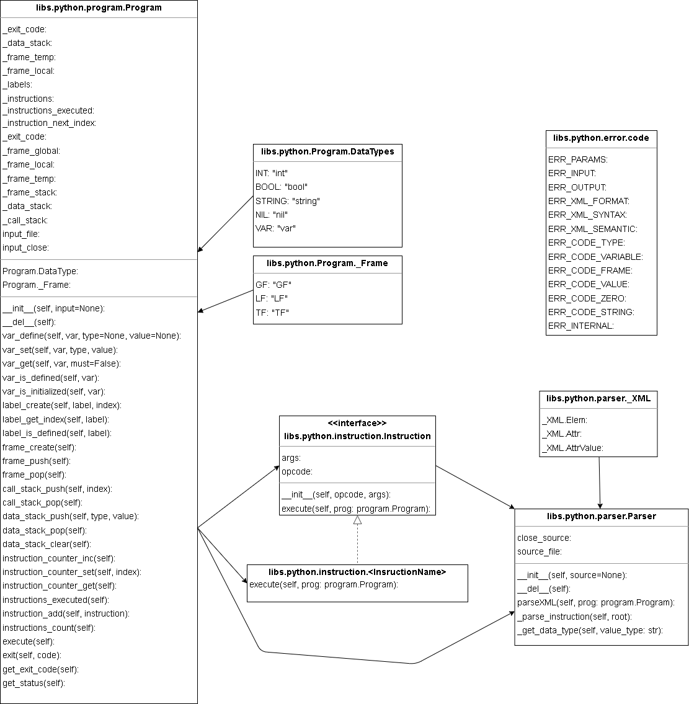

## Documentation of Project Implementation for 2. task IPP 2022/2023

Name and surname: Marek Gergel  
Login: xgerge01

---

## `interpret.py`

### Script parameters

Script takes following parameters:

- `--help`
- `--source=filename`
- `--input=filename`

Parameter parsing is done in `class Params`, where parameter values are stored in instance of class variables.

## Object oriented programming

### Factory design pattern

Factory design pattern was used for creating instances of instructions. Class `Parser` is used for creating instances of instructions. Class `Parser` has method `_parse_instruction(root)` which takes xml element with instruction and returns parsed instance of instruction class. Method is used in `parseXML(prog: program.Program)` which is used in for creating instances of instructions and adding to program instructions list.
Implementation of factory design pattern is not optimal and is missing more abstraction in instruction.

### Notes

Class `Program` was implemented class, which does not follow specific OOP design pattern. This implementation allows to create multiple instances of program in future development, which is not necessary for this project.

In script file `params.py` I have not found meaningful to use design pattern. In script file `error.py` could have been used design pattern in case of implementing more debug/error methods, but I have not found it necessary to implement it.

For most of program class variables was used encapsulation to ensure data integrity.

## Parsing of XML

Class `Parser` is used for pasing XML file. Instance of the class controls input stream opening and closing of XML file.
XML file is parsed in instance method `parseXML(prog: program.Program)` which takes instance of `class Program` where it stores parsed XML file data. For ease of use, file is parsed by library `xml.etree.ElementTree`.

## Code interpretation

Instructions of IPPcode23 are executed in `class Program`. Instance of the class controls input stream opening and closing of program input file. For instructions was used dynamic semantic analysis during execution. Instruction is executed by calling method `execute(prog: program.Program)` of specific instruction class which validates all required data that instruction needs. Method takes instance of `class Program` as parameter, which is used for accessing program data.

### Exit codes and error handling

In `error.py` in `class code` are stored all posible error codes that script analysis can exit with.  
Errors in the scripts are handled by function `exit(err_code: code, err_msg: str)`, which prints `err_msg` on `STDERR` and exits with `code`. Function `print(err_msg: str)` was used only for debug printing error messages on `STDERR`.

## Extensions of IPPcode23

### STACK

Extension is implemented by adding stack code variant to non stack instructions and adding new instruction `CLEARS`.
This solution has prevented duplicating operational code.

### FLOAT

Extension was not implemented, but it could be implemented by adding new instructions and adding new type `FLOAT` to datatypes classes and methods.

### STATI

Extension was not implemented. This extension could be reason to implement OOP and another design pattern in `class Params`.

## UML diagram

